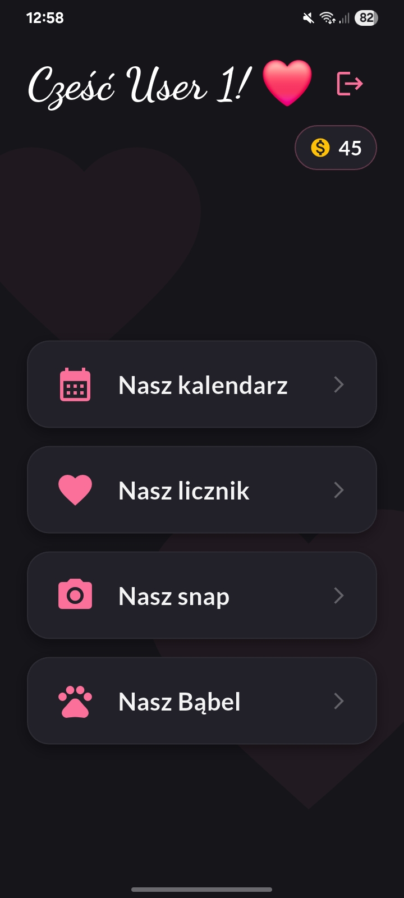
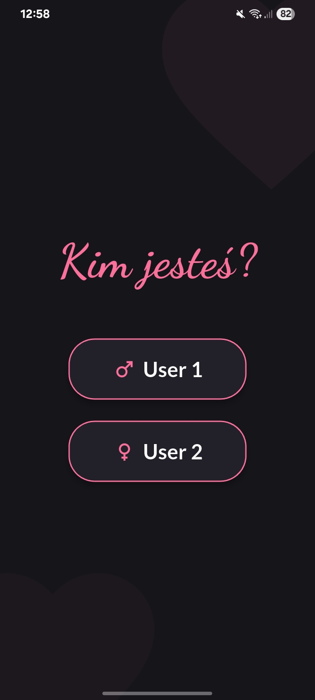
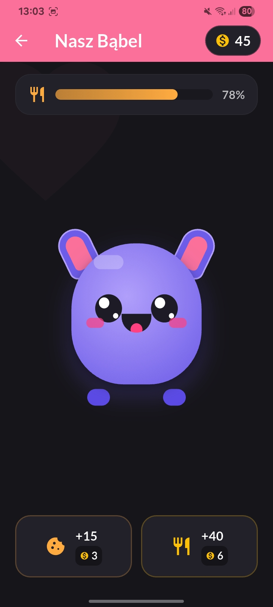
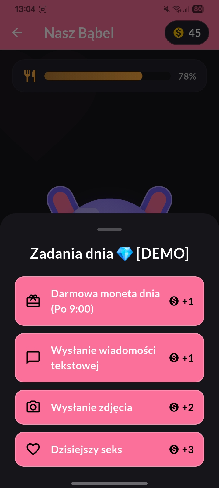
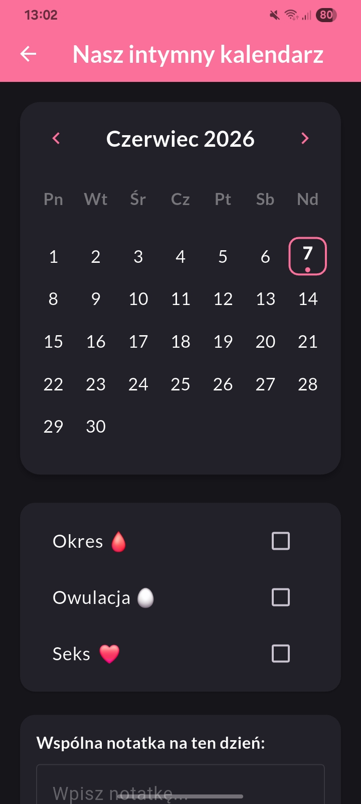
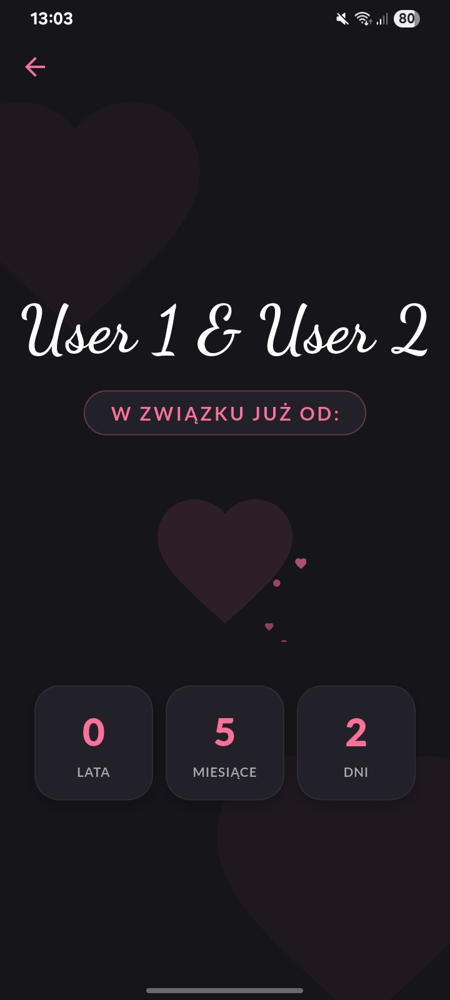
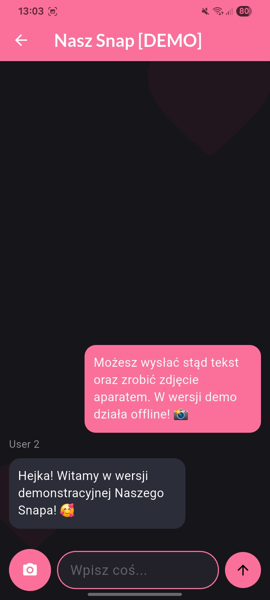

# 📱 Custom Couple Dashboard — Showroom Demo Version

[English translation below / Tłumaczenie na język angielski poniżej]

---

## 🇵🇱 Wersja Polska

Spersonalizowana aplikacja mobilna stworzona z myślą o unikalnych interakcjach dla dwóch połączonych użytkowników. W swojej produkcyjnej wersji projekt opiera się na centralnej bazie chmurowej **Firebase (Cloud Firestore)**, która synchronizuje w czasie rzeczywistym działania obu profili, łącząc ich dane (wiadomości, kalendarz, stan wirtualnego zwierzaka) w jeden, zintegrowany ekosystem.

Niniejsze repozytorium stanowi **w pełni zanonimizowaną wersję demonstracyjną (Showroom Demo)**. W celu ochrony prywatności oraz prezentacji czystego interfejsu UI, integracja sieciowa z Firebase została odpięta, a cała logika biznesowa opiera się na reaktywnym zarządzaniu stanem lokalnym oraz lokalnej persystencji danych.

---

### 🚀 Kluczowe Funkcjonalności

- **Dynamiczny Licznik Relacji:** Precyzyjnie oblicza czas trwania relacji w latach, miesiącach i dniach, wzbogacony o dedykowaną animację płynnego napełniania serca oraz unoszących się bąbelków.
- **Wspólny Kalendarz Intymny:** Dashboard do logowania kluczowych cykli biologicznych (okres, owulacja) oraz dodawania wspólnych notatek dziennych. Wersja produkcyjna automatycznie scala wpisy obu osób na jednej osi czasu.
- **Nasz Snap (Komunikator):** Symulacja prywatnego czatu efemerycznego. Obsługuje przesyłanie wiadomości tekstowych oraz pełną integrację z aparatem urządzenia (zdjęcia są kodowane do formatu Base64 i automatycznie wygasają po 2 sekundach od otwarcia).
- **Nasz Bąbel (Wirtualny Pupil):** Interaktywny symulator w stylu Tamagotchi z wbudowanym systemem spadku poziomu sytości w czasie. Posiada panel zadań dziennych generujący monety oraz sklep z posiłkami, wpływający na samopoczucie zwierzaka.

---

### 🛠️ Architektura i Zmiany w wersji Demo

1. **Pełna Anonimizacja:** Wszelkie personalne identyfikatory zostały zastąpione uniwersalnymi rolami `User 1` oraz `User 2` w obrębie widoków, nagłówków oraz kluczy pamięci.
2. **Local Persistence (SharedPreferences):** Stan wirtualnej waluty, poziom głodu Bąbla, logi kalendarza oraz preferencje sesji użytkownika są trwale zapisywane w pamięci lokalnej urządzenia.
3. **Lokalne Czcionki (100% Offline):** W celu eliminacji problemów sieciowych emulatorów i uniezależnienia aplikacji od zewnętrznych serwerów, czcionki _Lato_ oraz _Dancing Script_ zostały osadzone bezpośrednio w zasobach projektu (`assets/fonts/`).
4. **Brak Zależności Chmurowych:** Kod został całkowicie odpięty od usług Firebase, dzięki czemu aplikacja działa w trybie typu _Plug & Play_ natychmiast po sklonowaniu repozytorium.

---

### 📸 Prezentacja Wizualna (UI Preview)

#### Zrzuty Ekranu / Screenshots

|            Ekran Logowania / Login            |           Panel Główny / Main Menu            |         Wirtualny Bąbel / Virtual Pet         |
| :-------------------------------------------: | :-------------------------------------------: | :-------------------------------------------: |
|  |  |  |

|            Zadania Dnia / Daily Tasks             |           Wspólny Kalendarz / Calendar           |       Licznik Relacji / Milestone Counter       |
| :-----------------------------------------------: | :----------------------------------------------: | :---------------------------------------------: |
|  |  |  |

|          Prywatny Czat / Ephemeral Chat          |
| :----------------------------------------------: |
|  |

---

## 🇬🇧 English Version

A highly personalized mobile application tailored for unique, private interactions between two connected users. In its production build, the architecture utilizes a centralized cloud database (**Firebase Cloud Firestore**) to synchronize both profiles in real time, seamlessly merging their assets (ephemeral messages, shared calendar entries, and virtual pet metrics) into a single, cohesive ecosystem.

This repository represents a **fully anonymized Showroom Demo build**. To protect privacy and demonstrate clean UI capabilities, the live Firebase cloud layers have been decoupled. Instead, the core business logic relies entirely on reactive local state management and localized data persistence.

---

### 🚀 Key Features

- **Dynamic Relationship Counter:** Meticulously computes milestone durations in years, months, and days, powered by a custom fluid-fill heart animation and floating runtime bubble particles.
- **Shared Intimate Calendar:** A dedicated dashboard for logging biological cycles (period, ovulation) and capturing daily textual highlights. The production architecture automatically aggregates inputs from both users into one unified timeline.
- **Nasz Snap (Messaging Tool):** A private, ephemeral chat sandbox simulation. Supports full text-routing and real-time hardware camera integration (images are processed into Base64 strings and feature a strict 2-second viewing expiration timeline).
- **Nasz Bąbel (Virtual Companion):** An interactive Tamagotchi-inspired pet simulator featuring background time-based hunger drains. Includes a daily reward token economy panel and an asset store to feed the companion.

---

### 🛠️ Engineering & Showcase Adaptations

1. **Comprehensive Anonymization:** All personal real-world identifiers have been replaced with generic `User 1` and `User 2` roles across headers, routing components, and storage keys.
2. **Local Persistence Partitioning:** Virtual currencies, Bąbel's metabolism statistics, calendar benchmarks, and session states persist smoothly on the host machine using `SharedPreferences`.
3. **Local Assets Integration (100% Offline):** To eliminate networking bottlenecks on sandboxed emulators, the _Lato_ and _Dancing Script_ typeface families have been locally bundled inside the `assets/fonts/` directory.
4. **Decoupled Cloud Infrastructure:** All live Firebase initialization branches have been cleanly removed, making the standalone repository completely _Plug & Play_ for quick review.

---

### 📸 UI Preview (English Grid)

|                  Login View                   |                Main Dashboard                 |               Virtual Companion               |                 Shared Calendar                  |                  Ephemeral Chat                  |
| :-------------------------------------------: | :-------------------------------------------: | :-------------------------------------------: | :----------------------------------------------: | :----------------------------------------------: |
|  |  |  |  |  |
